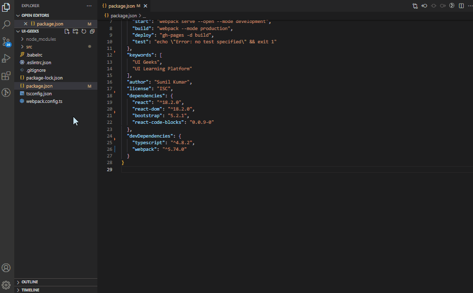

# npm-dependencies-ui-geeks 

This extention will generate NPM Package Dependencies report, which can also be downloaded in PDF format.
  

  

## Installation

1. Install Visual Studio Code 0.10.1 or higher.
2. Launch VS Code.
3. Launch the command palette by using Ctrl-Shift-P (Windows, Linux) or Cmd-Shift-P (OSX).
4. Type in Install Extension and select 'Extensions : Install Extensions'.
5. Type NPM Dependency Report.
6. Choose the extension from the drop down.
7. Reload Visual Studio Code.

 

## Usage

### From Command palette

1.  Launch the command palette by using Ctrl-Shift-P (Windows, Linux) or Cmd-Shift-P (OSX).
2.  Type <b>NPM Dependency Report<b>.

### From Context Menu

1.  Right click on <b>package.json</b> file in File Explorer.
2.  Select 'NPM Dependency Report' from the context menu.
      

## Contact

If you have any issues report them at <a href='https://github.com/skumar-mca/ui-geeks-ext-package-dep/issues'>Issues</a>
  

## Source

<a href='https://github.com/skumar-mca/ui-geeks-ext-package-dep'>Github</a>
 

 

## Want to appreciate the work

 

  Your opportunity to say thanks for the free stuff and to encourage me to do even more  

